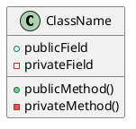
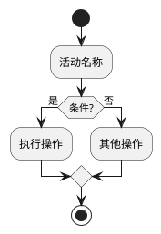
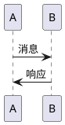

# PlantUML 使用指南

## 概述
PlantUML是一个强大的UML图表生成工具，支持多种图表类型，包括类图、时序图、活动图、用例图等。

## 安装配置

### 方法一：Chocolatey快速安装（推荐）

#### 1. 安装Chocolatey包管理器
以管理员身份打开PowerShell，运行：
```powershell
Set-ExecutionPolicy Bypass -Scope Process -Force; [System.Net.ServicePointManager]::SecurityProtocol = [System.Net.ServicePointManager]::SecurityProtocol -bor 3072; iex ((New-Object System.Net.WebClient).DownloadString('https://community.chocolatey.org/install.ps1'))
```

#### 2. 安装PlantUML
```powershell
choco install plantuml
```

这个命令会自动安装：
- PlantUML.jar
- GraphViz（最新版本）
- Java运行时环境（如果需要）

#### 3. 配置说明
- 使用本地渲染器（`plantuml.render: "Local"`）
- PlantUML.jar路径：`C:\ProgramData\chocolatey\lib\plantuml\tools\plantuml.jar`
- 配置文件：`.vscode/settings.json`

### 方法二：在线服务器（备选方案）

#### 1. 扩展安装
- PlantUML扩展已安装：`jebbs.plantuml`
- 版本：v2.18.1

#### 2. Java环境
**重要**：需要安装Java运行时环境（JRE）
- 下载地址：[Oracle Java](https://www.oracle.com/java/technologies/downloads/) 或 [OpenJDK](https://adoptium.net/)
- 安装后确保Java在系统PATH中

#### 3. 配置说明
- 使用在线服务器渲染（`plantuml.render: "PlantUMLServer"`）
- 配置文件：`.vscode/settings_online.json`（复制为 `settings.json`）

### 方法三：手动安装

#### 1. 下载PlantUML.jar
- 访问 [PlantUML官网](https://plantuml.com/download)
- 下载最新版本的 `plantuml.jar`

#### 2. 安装GraphViz
- 下载地址：[GraphViz官网](https://graphviz.org/download/)
- 安装后设置环境变量 `GRAPHVIZ_DOT`

#### 3. 配置VS Code
```json
{
    "plantuml.render": "Local",
    "plantuml.jar": "path/to/plantuml.jar",
    "plantuml.exportFormat": "png"
}
```

## 使用方法

### 1. 创建UML文件
- 文件扩展名：`.puml`
- 位置：`docs/uml/` 目录

### 2. 预览图表
- 打开 `.puml` 文件
- 按 `Alt+Shift+D` 预览图表
- 或右键选择 "Preview Current Diagram"

### 3. 导出图表
- 按 `Ctrl+Shift+P` 打开命令面板
- 输入 "PlantUML: Export Current Diagram"
- 选择导出格式（PNG、SVG、PDF等）

## 项目中的UML文件

### 1. 项目架构图
- 文件：`docs/uml/project_architecture.puml`
- 描述：展示EDA电路分区项目的整体架构和类关系

### 2. KL算法流程图
- 文件：`docs/uml/kl_algorithm_flow.puml`
- 描述：展示KL算法的执行流程和决策点

## 常用语法

### 类图语法


### 活动图语法


### 时序图语法


## 主题和样式

### 自定义主题
```plantuml
!theme plain
skinparam backgroundColor #FFFFFF
skinparam classBackgroundColor #E8F4FD
```

### 常用样式参数
- `backgroundColor`: 背景颜色
- `classBackgroundColor`: 类背景颜色
- `classBorderColor`: 类边框颜色
- `packageBackgroundColor`: 包背景颜色

## 故障排除

### 1. 图表无法渲染
- **本地渲染**：检查Java和PlantUML.jar是否正确安装
- **在线渲染**：检查网络连接和PlantUML语法
- 确认PlantUML语法是否正确

### 2. 导出失败
- 确保导出目录存在
- 检查文件权限
- 尝试不同的导出格式

### 3. 性能问题
- 大型图表可能需要较长时间渲染
- 本地渲染通常比在线渲染更快
- 优化图表复杂度

### 4. Chocolatey安装问题
- 确保以管理员身份运行PowerShell
- 检查网络连接
- 如果安装失败，可以尝试在线服务器方案

## 最佳实践

1. **文件组织**：将UML文件放在专门的目录中
2. **命名规范**：使用描述性的文件名
3. **版本控制**：将UML文件纳入版本控制
4. **文档同步**：及时更新UML图表以反映代码变化
5. **简洁明了**：避免过于复杂的图表，保持清晰度

## 扩展功能

### 1. 自定义宏
可以定义常用的样式和组件：
```plantuml
!define RECTANGLE class

@startuml
RECTANGLE MyClass {
    +field
}
@enduml
```

### 2. 包含文件
可以将复杂的图表拆分为多个文件：
```plantuml
!include common.puml
!include components.puml
```

### 3. 条件编译
根据环境生成不同的图表：
```plantuml
!if %LIGHT_THEME
    !theme plain
!else
    !theme dark
!endif
```

## 配置切换

### 切换到在线服务器
如果本地安装有问题，可以切换到在线服务器：
1. 复制 `settings_online.json` 为 `settings.json`
2. 重启VS Code

### 切换到本地渲染
如果在线服务器不稳定，可以切换到本地渲染：
1. 确保已安装Chocolatey和PlantUML
2. 使用当前的 `settings.json` 配置 